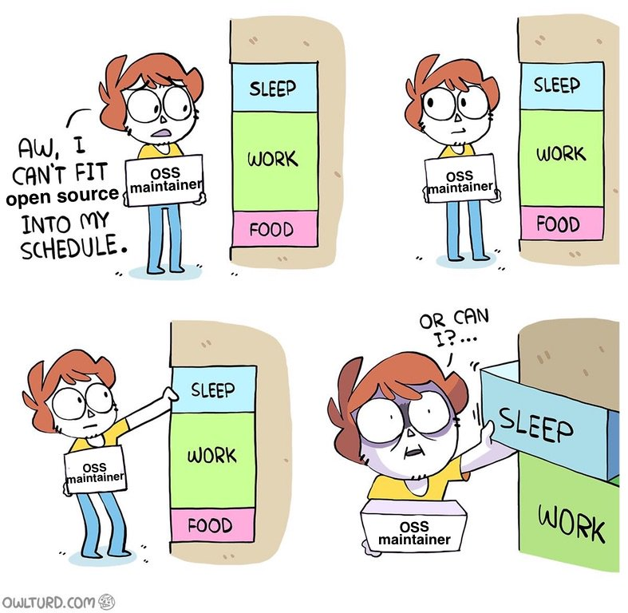
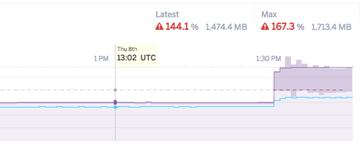
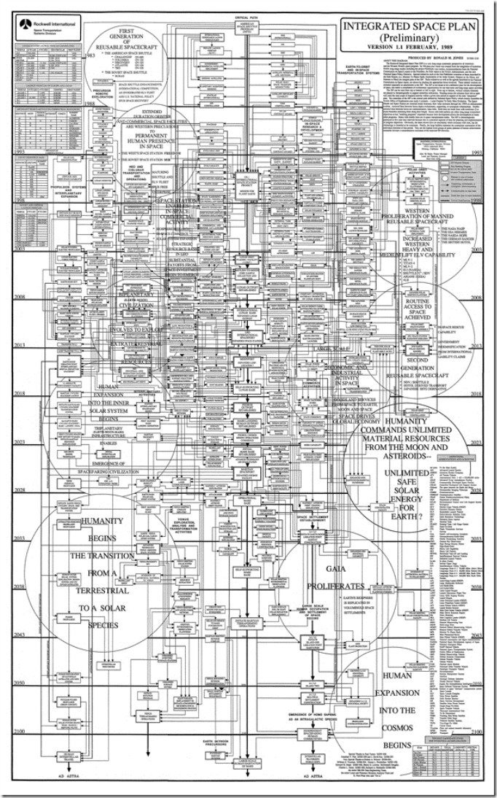
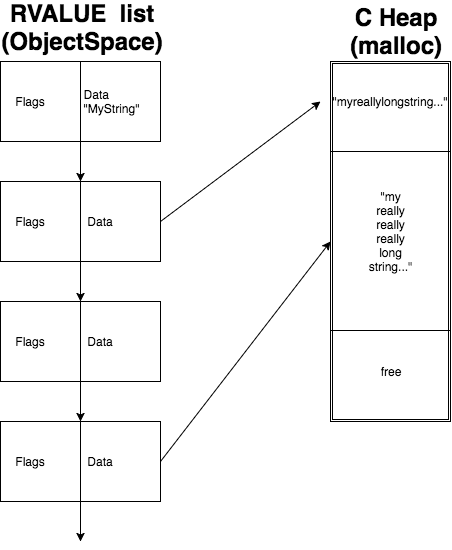
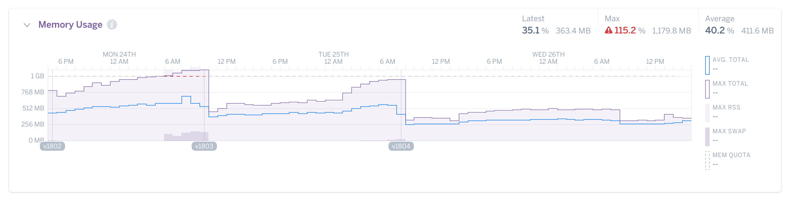

# Memory Fragmentation
### and
# Bloat in Ruby

## Nate Berkopec
## Speedshop.co


----



----


----


----

# Memory constrained environments

## * Embedded
## * 512 MB dynos
## * 50% (?) of Rails apps are memory-constrained

---

# Memory behavior is 
# [fit] difficult 
# for Rubyists to understand

^ Memprof, etc other tools hard to use
^ Requires knowledge of MRI internals sometimes to debug
^ It would be better if we could just *not have memory problems*

----

# Layers of Abstraction 

1. Your Ruby code itself
2. Ruby runtime
3. Allocator
4. MMU (virtual/real memory)
5. Actual memory location (swap/RAM)

---

# We should prevent memory overuse
# or make it 
# [fit] easier to 
# [fit] debug and fix

---

# [fit] Bloat


---

# [fit] Pattern

## [fit] Sudden spikes
## in memory, slow/no falloff


---



---

# memory usage that's
# [fit] necessary, but 
# [fit] excessive

---
  
# Primarily a function of the 
# [fit] runtime and your 
# [fit] user code

---

# Contributes to Rails processes that need 
# [fit] ~1GB each

---


---

# API::V1::Admin::ExportsController

```ruby
def index
  @every_single_user.to_csv
end
```

---

> Note that, **in general, "freeing" memory does not
> actually return it to the operating system** for other
> applications to use.
> However, if the top chunk in a heap - the portion adjacent to unmapped memory - becomes large enough, some of that memory may be unmapped and returned to the operating system.

- [MallocInternals](https://sourceware.org/glibc/wiki/MallocInternals)

---

> Closing as NOTABUG based on comment 3.  malloc/free indeed cannot give address space back to the kernel when main arena is discontinuous and that is **expected behaviour**.

- [Malloc bug 15321](https://sourceware.org/bugzilla/show_bug.cgi?id=15321)

---

# [fit] Solution(?): 
# [fit] Pain 
# in interfaces


---


---

# Minitest: painful stubs

```ruby
Time.stub :now, Time.at(0) do
  assert obj_under_test.stale?
end
```

---

# Rails "strict mode"

```ruby
SomeModel.all.each # *always* batches
SomeModel.select(:some_attribute) # *always* select
```

---

# [fit] Enumerable

```ruby
raise CollectionTooLargeError # dev only, WARN in prod
some_huge_collection.map # raise
```

---

# But this can be abused:
# We don't want to "think like a 
# [fit] computer"

^ A bit like type annotations
^ False positives here are very costly
^ dev mode may not trigger


---

> No user-level memory management
> Ruby has automatic memory management.

- Ruby manpage

---

# [fit] Solution(?): 
# Just allocate less
    
## Sinatra vs Rails

^ "Just program better" is not a good plan

---

# [fit] Solution(?): 
# [fit] aggressive 
# [fit] de-allocation

^ Which is a problem because of...

---

# [fit] Fragmentation


---

# [fit] Pattern: 

## Slow, endless "logarithmic" growth in long-running Ruby programs

---


---

# [fit] Swiss 
# [fit] Cheese

---

# [fit] Web Request
# [fit] Allocation
# [fit] Pattern

---

# Primarily 
# [fit] runtime
# [fit] and allocator

---

# Often 
# [fit] mistaken 
# [fit] for leaks
# (linear v log growth)

---
   
# [fit] GC.stat


---

# [fit] RUBY GC 
# [fit] internals in 
# [fit] 60 seconds

---



---

# Every object is given a 40-byte 
# [fit] RVALUE

---

# Organized into 
# [fit] 408-slot 
# [fit] "HEAP PAGES"

---

# Some (most?) objects contain a pointer to `malloc`ed memory where actual object data is stored

---



---

```ruby
5.times { GC.start }
GC.stat[:heap_live_slots] # 24508
GC.stat[:heap_eden_pages] # 83
GC::INTERNAL_CONSTANTS[:HEAP_PAGE_OBJ_LIMIT] # 408

# live_slots / (eden_pages * slots_per_page)
# 24508 / (83 * 408) = 72.3%

```

---


---


---

```ruby
GC.stat[:heap_sorted_length] # 83

# sorted_length / eden_pages
# 1
```

---

# [fit] Allocator


---

# [fit] Problem: 
# [fit] per-thread arenas in glibc
    
---

# [fit] "puma uses more 
# [fit] memory than 
# [fit] unicorn" 

---

# [fit] "Sidekiq is
# [fit] leaking"
---

# [fit] per-thread 
# [fit] memory arenas 
# reduce contention
# for the main arena

---

> As pressure from thread collisions increases, additional arenas are created via mmap to relieve the pressure. The number of arenas is capped at eight times the number of CPUs in the system [...], but **the trade-off is that there will be less fragmentation**.

- [MallocInternals](https://sourceware.org/glibc/wiki/MallocInternals)

---

# [fit] `MALLOC_ARENA_MAX`

---



---

# [fit] Major source of 
# [fit] Ruby 
# [fit] fragmentation?

---

# [fit] Solution(?): 
# [fit] Reduce allocations

---

# [fit] Solution(?): 
# [fit] Managed malloc

* Memory pools or slabs in the runtime
* Memcached does this
* Multiple heaps
* "Buddy blocks"
* Eliminates the allocator

---

# [fit] Solution(?): 
# [fit] Just use Jemalloc

* Memory contiguity is unspecified!
* Rust: use jemalloc-specfic features

---


    
---

# [fit] Solution(?): 
# [fit] Hard defaults

* Disable memory arenas
* JEMalloc, etc
* Disable THP

---

# [fit] Tradeoffs


---

# [fit] Thank you!
# @nateberkopec
# More tactics at:
# railsspeed.com
